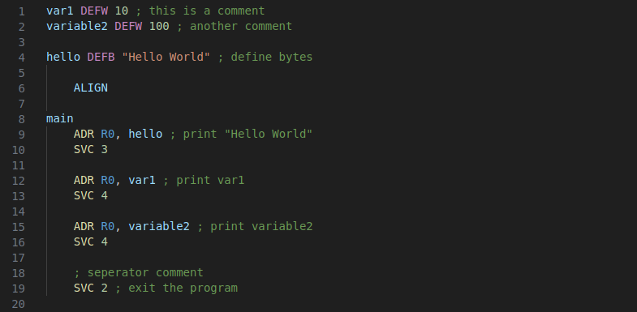
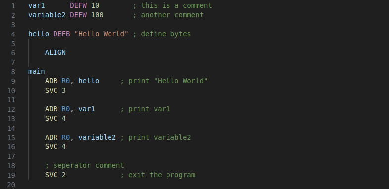

# format-arm README

A small extension to make formatting of ARM assembly code easier. 
Designed to be used in conjunction with the ARM instruction set used in teaching at the University of Manchester, so compatibility with other instruction sets is not guaranteed.

## Features
Provides a single command, `Format ARM`, which will align comments and similar blocks of code, such as `DEFW` and `DEFB` blocks. Comments are aligned with other comments in the same label block as themselves, and comments outside any label are aligned together. Furthermore, comments used as seperators, or not at the end of a line of code, are not changed.  
For example:  

becomes:

## Release Notes
### 1.0.0
Initial release of format-arm
